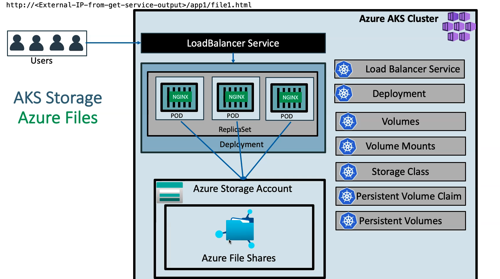

# Azure Files for AKS Storage

## APP Architecture

&nbsp;

## Step-01: Introduction
- Understand Azure Files
- We are going to write a Deployment Manifest for NGINX Application which will have its static content served from **Azure File Shares** in **app1** folder
- We are going to mount the file share to a specific path `mountPath: "/usr/share/nginx/html/app1"` in the Nginx container

### kube-manifests-v1: Custom Storage Class
- We will define our own custom storage class with desired permissions 
  - Standard_LRS - standard locally redundant storage (LRS)
  - Standard_GRS - standard geo-redundant storage (GRS)
  - Standard_ZRS - standard zone redundant storage (ZRS)
  - Standard_RAGRS - standard read-access geo-redundant storage (RA-GRS)
  - Premium_LRS - premium locally redundant storage (LRS)

### kube-manifests-v2: AKS defined default storage class
- With default AKS created storage classes only below two options are available for us.
  - Standard_LRS - standard locally redundant storage (LRS)
  - Premium_LRS - premium locally redundant storage (LRS)  

- **Important Note:** Azure Files support premium storage in AKS clusters that run Kubernetes 1.13 or higher, minimum premium file share is 100GB


## Step-02: Create or Review kube-manifests-v1 and Nginx Files
- Kube Manifests
  - 01-Storage-Class.yml
  - 02-Persistent-Volume-Claim.yml
  - 03-Nginx-Deployment.yml
  - 04-Nginx-Service.yml
- nginx-files  
  - file1.html
  - file2.html

- k8s Deployment maniest - core item for review
```yml
          volumeMounts:
            - name: my-azurefile-volume
              mountPath: "/usr/share/nginx/html/app1"
      volumes:
        - name: my-azurefile-volume
          persistentVolumeClaim:
            claimName: my-azurefile-pvc    
```  

## Step-03: Deploy Kube Manifests V1
```
# Deploy
kubectl apply -f kube-manifests-v1/

# Verify SC, PVC, PV
kubectl get sc, pvc, pv

# Verify Pod
kubectl get pods
kubectl describe pod <pod-name>

# Get Load Balancer Public IP
kubectl get svc

# Access Application
http://<External-IP-from-get-service-output>
http://<External-IP-from-get-service-output>/app1/index.html
```

## Step-04: Upload Nginx Files to Azure File Share
- Go to Storage Accounts
- Select and Open storage account under resoure group **mc_aks-rg1_aksdemo1_eastus**
- In **Overview**, go to **File Shares**
- Open File share with name which starts as **kubernetes-dynamic-pv-xxxxxx**
- Click on **Upload** and upload 
  - file1.html 
  - file2.html

## Step-05: Access Application & Test
```
# URLs
http://<External-IP-from-get-service-output>/app1/file1.html
http://<External-IP-from-get-service-output>/app1/file2.html
```  

## Step-06: Clean-Up
```
# Delete
kubectl delete -f kube-manifests-v1/
```

## Step-07: Create or Review kube-manifests-v2 and Nginx Files
- Kube Manifests
  - 01-Persistent-Volume-Claim.yml
  - 02-Nginx-Deployment.yml
  - 03-Nginx-Service.yml
- nginx-files  
  - file1.html
  - file2.html


## Step-08: Deploy Kube Manifests V2
```
# Deploy
kubectl apply -f kube-manifests-v2/

# Verify SC, PVC, PV
kubectl get sc, pvc, pv

# Verify Pod
kubectl get pods
kubectl describe pod <pod-name>

# Get Load Balancer Public IP
kubectl get svc

# Access Application
http://<External-IP-from-get-service-output>
```

## Step-09: Upload Nginx Files to Azure File Share
- Go to Storage Accounts
- Select and Open storage account under resoure group **mc_aks-rg1_aksdemo1_eastus**
- In **Overview**, go to **File Shares**
- Open File share with name which starts as **kubernetes-dynamic-pv-xxxxxx**
- Click on **Upload** and upload 
  - file1.html 
  - file2.html

## Step-10: Access Application & Test
```
# URLs
http://<External-IP-from-get-service-output>/app1/file1.html
http://<External-IP-from-get-service-output>/app1/file2.html
```  

## Step-11: Clean-Up
```
# Delete
kubectl delete -f kube-manifests-v2/
```

## References
- https://docs.microsoft.com/en-us/azure/aks/azure-files-dynamic-pv